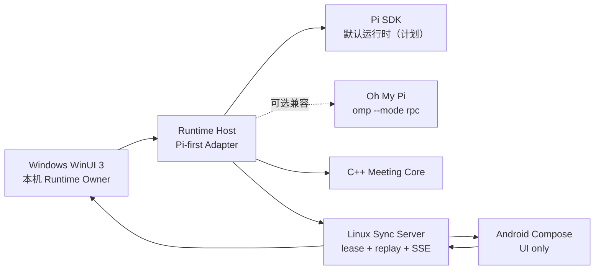

# Pi Roundtable

Pi Roundtable 是一个原生 GUI 优先的多角色圆桌会议平台脚手架。目标是让多个角色实时发言、互相打断、调用工具并派出 SubAgent，同时把运行时、同步服务和各平台界面解耦。

## 当前状态

| 模块 | 状态 | 说明 |
| --- | --- | --- |
| `protocol` | 已搭建 | 版本化 JSON Schema 与 TypeScript 契约；已加入长短期角色生命周期事件 |
| `core` | 已实现基础 | 无外部依赖的 C++20 会议状态机、租约代次 fencing、打断、角色晋升/归档状态转换、C ABI 与测试 |
| `packages/runtime-host` | 已搭建领域中立接口、已实现 OMP 基础适配 | Pi-first `RuntimeAdapter` 契约；`omp --mode rpc` JSONL/v2 低层兼容客户端；直接 Pi SDK 适配仍为计划 |
| `packages/sync-server` | 已实现基础 | 内存事件日志、单运行时租约、游标回放、HTTP/SSE 开发服务器 |
| `apps/android` | 脚手架已验证 | Kotlin + Jetpack Compose Material 3，自适应手机/平板界面；Debug APK 与单元测试已在本机通过，尚未接入同步服务 |
| `apps/windows` | 工程脚手架 | C# + WinUI 3 原生界面；当前机器缺少 .NET SDK/WinUI workload，尚未本机编译 |

“已搭建/已实现基础”不表示已经部署。身份认证、持久化数据库、端到端加密、推送通知和生产级重连仍是后续工作。

## 架构边界



核心约束：

- 每场会议同一时刻只有一个权威 Runtime Owner；服务器用 `runtimeGeneration` 防止旧实例继续写入。
- 无远程服务器时，Windows 仍应能完成正常本地会议；Linux 服务是可选同步平面，不执行模型。
- 客户端只依赖版本化协议；Pi/OMP 内部事件和原始会话必须留在 Runtime Host 内部。
- 移动端使用前台流式连接、游标回放与后续推送，不假设永久后台 WebSocket。
- 角色打断是显式状态转换：请求打断 → 取消当前发言 → 新角色取得发言权。

更完整的边界见 [架构说明](docs/architecture.md)、[运行时所有权 ADR](docs/adr/0001-runtime-ownership.md) 和 [Pi-first 运行时 ADR](docs/adr/0003-pi-first-runtime.md)。

## 快速开始

### C++ 核心

```powershell
cmake --preset dev
cmake --build --preset dev
ctest --preset dev
```

### TypeScript 服务

```powershell
npm install
npm run build
npm test
npm run dev:sync
```

开发服务器默认监听 `http://127.0.0.1:4317`。它没有身份认证，只能用于本机开发。

### Android

```powershell
.\scripts\android-build.ps1
```

要求 JDK 17 与 Android SDK 37。脚本会把当前 `HTTPS_PROXY`/`HTTP_PROXY` 显式转换为 Gradle JVM 代理参数，但不会记录代理凭据。若 SDK 不在默认位置，请设置 `ANDROID_HOME`，或在未纳入版本控制的 `local.properties` 中设置 `sdk.dir=...`。

### Windows

安装 .NET 8 SDK、Visual Studio 2022 的 WinUI 应用开发工作负载后：

```powershell
dotnet restore apps/windows/PiRoundtable.Windows/PiRoundtable.Windows.csproj
dotnet build apps/windows/PiRoundtable.Windows/PiRoundtable.Windows.csproj
```

## 版本基线

- Pi：默认运行时目标；SDK 版本将在直接集成里程碑固定并验证。
- Oh My Pi：可选兼容适配目标为正式版 `v17.2.2`；只通过公开 RPC 协议接入。
- Android：AGP `9.1.1`、Gradle `9.3.1`、JDK 17、Compose BOM `2026.06.00`。
- Windows：Windows App SDK `2.3.1`、`.NET 8`。
- Node.js：开发基线 Node 24。

版本选择与集成风险记录在 [依赖基线](docs/dependency-baseline.md)。
