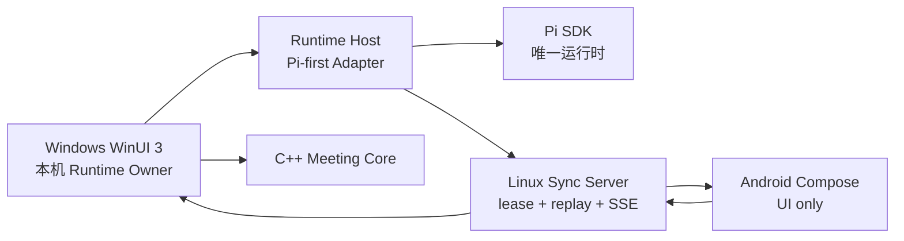

# Pi Roundtable

Pi Roundtable 是一个原生 GUI 优先的多角色圆桌会议平台。当前交付面是 Pi-only、Windows local-first alpha：多个角色可以实时发言、互相打断、经人类审批调用工具并派出隔离 SubAgent，同时运行时、同步服务和各平台界面保持解耦。

## 当前状态

| 模块 | 状态 | 说明 |
| --- | --- | --- |
| `protocol` | 已实现契约基础 | 版本化 JSON Schema、TypeScript 类型与目录引用完整性校验；包含工作区、会话、冻结参与者清单及长短期角色生命周期 |
| `core` | 已实现本地闭环基础 | C++20 状态机验证 Runtime Owner、租约代次、角色生命周期、发言、中断交接与完整会议闭环；提供稳定 C ABI |
| `packages/runtime-host` | 已实现本地多角色 Host | 固定 Pi SDK；每角色一会话；按冻结清单解析模型、System Prompt、Skill 与精确 MCP tool allowlist；公开 `@` 目标顺序发言且每个目标只以自身身份作答；MCP 工具发现/调用及私有审批；不可递归、每父角色最多 2 个的隔离 SubAgent；stdio JSONL v3；持久命令回执、全局序号/代次与规范化事件 |
| `packages/sync-server` | 已实现受控远端基础 | 所有 `/v1` 路由使用签名设备令牌；运行时租约、代次围栏、游标回放、私有 audience 过滤、HTTP/SSE；可选 PostgreSQL 事务存储，无数据库时明确退回仅限开发的内存实现 |
| `apps/android` | 脚手架已验证 | Kotlin + Jetpack Compose Material 3，自适应手机/平板界面；Debug APK 与单元测试已在本机通过，尚未接入同步服务 |
| `apps/windows` | 已实现并验证本地 alpha 闭环 | .NET 10 + WinUI 3；自适应会话轨道、严格单/多角色 `@`、公开/私聊、审批到期与 SubAgent 活动；安全原生 Markdown、LaTeX 源码回退、长记录虚拟化/跟随/跳到最新；会话 JSON/Markdown 导出与非破坏性导入预检；逐角色模型/System Prompt/Skill/MCP；Credential Manager；DPAPI + SQLite 重放及代次恢复；自包含 x64 MSI；ECDSA 签名更新清单、固定公钥、大小/SHA-256 校验及独立更新辅助程序 |

“已实现/已验证”描述当前工作站和仓库测试面，不表示已经生产部署。仓库不保存提供商凭据。MSI Authenticode 签名、真正的公式排版引擎、ARM64、客户端远端同步接入、E2EE、TLS/限流/保留任务、多副本通知、推送和生产级重连仍是后续工作。

## 架构边界



核心约束：

- 每场会议同一时刻只有一个权威 Runtime Owner；服务器用 `runtimeGeneration` 防止旧实例继续写入。
- 无远程服务器时，Windows 仍应能完成正常本地会议；Linux 服务是可选同步平面，不执行模型。
- 客户端只依赖版本化协议；Pi 内部事件和原始会话必须留在 Runtime Host 内部。
- 移动端使用前台流式连接、游标回放与后续推送，不假设永久后台 WebSocket。
- 角色打断是显式状态转换：请求打断 → 取消当前发言 → 新角色取得发言权。

更完整的边界见 [架构说明](docs/architecture.md)、[运行时所有权 ADR](docs/adr/0001-runtime-ownership.md)、[Pi-first 运行时 ADR](docs/adr/0003-pi-first-runtime.md)、[现代 Agent/Windows 基线 ADR](docs/adr/0004-modern-agent-and-windows-baseline.md)、[本地纵向闭环 ADR](docs/adr/0005-local-roundtable-vertical-slice.md) 和 [会话与能力清单 ADR](docs/adr/0006-session-workspaces-and-capability-manifests.md)。客户端信息架构见 [会话中心设计](docs/product/session-centered-client.md)。

## 快速开始

### C++ 核心

```powershell
cmake --preset dev
cmake --build --preset dev
ctest --preset dev
```

### TypeScript 服务

```powershell
npm install
npm run build
npm test
npm run dev:sync
```

同步服务默认监听 `http://127.0.0.1:4317`。健康检查无需认证；所有 `/v1` 路由都要求由 `PI_ROUNDTABLE_AUTH_KEYS_JSON` 验证的签名设备令牌。未设置 `DATABASE_URL` 时仅使用内存存储，适合有界本机开发；配置 PostgreSQL 后启动时会应用幂等迁移。令牌约束和待完成的 TLS/E2EE 边界见 [`packages/sync-server/README.md`](packages/sync-server/README.md)。

### Android

```powershell
.\scripts\android-build.ps1
```

要求 JDK 17 与 Android SDK 37。脚本会把当前 `HTTPS_PROXY`/`HTTP_PROXY` 显式转换为 Gradle JVM 代理参数，但不会记录代理凭据。若 SDK 不在默认位置，请设置 `ANDROID_HOME`，或在未纳入版本控制的 `local.properties` 中设置 `sdk.dir=...`。

### Windows

安装仓库 `global.json` 所指定的 .NET 10 SDK 与 Visual Studio 的 WinUI 应用开发工作负载后，先构建 Runtime Host 与本机 Core：

```powershell
node --version
npm run build
cmake --preset dev
cmake --build --preset dev
dotnet restore apps/windows/PiRoundtable.Windows/PiRoundtable.Windows.csproj
dotnet build apps/windows/PiRoundtable.Windows/PiRoundtable.Windows.csproj
```

开发客户端会向上查找 `packages/runtime-host/dist/host-main.js`，并在 x64 构建时复制 `out/build/dev/core/pi_roundtable_core.dll`。也可分别用 `PI_ROUNDTABLE_RUNTIME_HOST_SCRIPT` 与 `PI_ROUNDTABLE_NODE_PATH` 指定路径。非敏感工作区配置保存到 `%LOCALAPPDATA%\PiRoundtable\workspace.v1.json`，会话定义保存到 `%LOCALAPPDATA%\PiRoundtable\sessions\`；规范化事件写入 `%LOCALAPPDATA%\PiRoundtable\data\roundtable.db`，其中事件内容由当前用户 DPAPI 加密。API Key 按 `credentialRef` 保存到 Windows Credential Manager，启动时只把本场角色所需凭据通过一次性 stdin 初始化帧交给本地子进程，不进入环境、事件或 JSON 配置。

生成未签名但可由签名清单安全分发的自包含 x64 MSI：

```powershell
pwsh -File .\scripts\build-windows-x64.ps1 -Version 0.2.0
```

脚本先运行 C++、TypeScript 和 Windows 测试，再发布 WinUI、自带 Node/Pi Runtime Host 和 C++ Core，最后输出 `out\installer\PiRoundtable-0.2.0-win-x64.msi` 及 SHA-256。客户端更新器只接受固定 ECDSA P-256 公钥验证通过的规范清单，并逐字节验证 MSI 大小和 SHA-256；当前 MSI 仍未做 Authenticode 签名，因此清单必须保持 `authenticodeRequired: false`。真实安装/卸载与 0.1→0.2 升级由发布验收执行；修复矩阵、代码签名和 ARM64 MSI 仍为 pending。

已有测试凭据时，可对发布目录执行一次不回显 Key 的真实 DeepSeek/Pi 三角色、两轮全链路验收：

```powershell
pwsh -File .\scripts\run-windows-deepseek-roundtable.ps1 `
  -KeyFile C:\path\to\Deepseek.txt `
  -AppDirectory .\out\package\windows-x64\app
```

脚本通过临时 Windows Credential Manager 记录向客户端提供凭据：第一轮单点名只允许体系架构师回答，并核验表格、任务项、LaTeX 源码块和 PowerShell 代码块；第二轮双点名只允许产品体验官与风险审查员回答。最终必须恰好得到 3 条角色输出。证据只在 `out\e2e\` 保存角色、字符数、输出 SHA-256、事件归属与截图；脚本逐文件扫描 Key 并在退出后删除临时凭据。实现现状、参考项目迁移边界和后续 P0/P1 见 [Agent 客户端实践与差距审计](docs/research/2026-08-02-agent-client-practices-and-gap-analysis.md)。

## 版本基线

- Pi：默认运行时，`@earendil-works/pi-coding-agent` 与 `@earendil-works/pi-ai` 固定为 `0.83.0`。
- Android：AGP `9.1.1`、Gradle `9.3.1`、JDK 17、Compose BOM `2026.06.00`。
- Windows：Windows App SDK `2.3.1`、`.NET 10` LTS。
- Node.js：开发基线 Node 24。

版本选择与集成风险记录在 [依赖基线](docs/dependency-baseline.md)。
