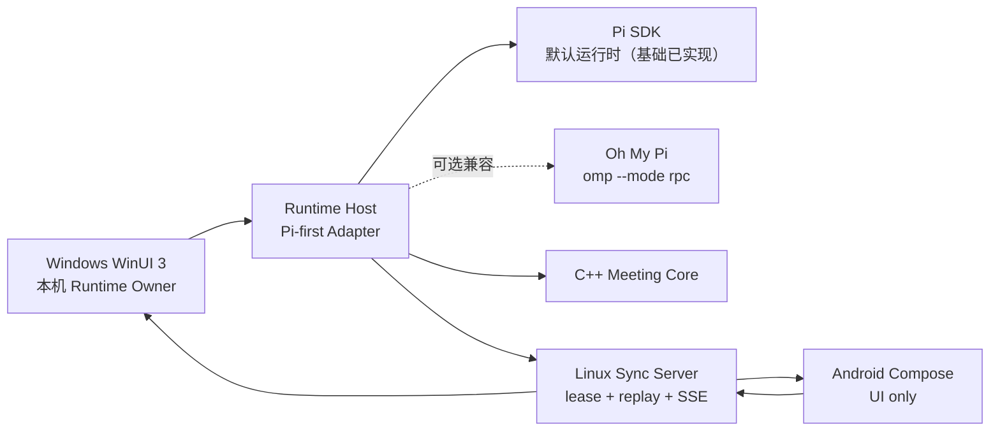

# Pi Roundtable

Pi Roundtable 是一个原生 GUI 优先的多角色圆桌会议平台脚手架。目标是让多个角色实时发言、互相打断、调用工具并派出 SubAgent，同时把运行时、同步服务和各平台界面解耦。

## 当前状态

| 模块 | 状态 | 说明 |
| --- | --- | --- |
| `protocol` | 已实现契约基础 | 版本化 JSON Schema、TypeScript 类型与目录引用完整性校验；包含工作区、会话、冻结参与者清单及长短期角色生命周期 |
| `core` | 已实现本地闭环基础 | C++20 状态机验证 Runtime Owner、租约代次、角色生命周期、发言、中断交接与完整会议闭环；提供稳定 C ABI |
| `packages/runtime-host` | 已实现本地多角色 Host 基础 | 固定 Pi SDK；每角色一会话；按冻结清单解析模型、System Prompt 与 Skill；stdio JSONL v2；全局序号/代次、命令幂等与规范化事件；MCP/工具执行仍关闭 |
| `packages/sync-server` | 已实现基础 | 内存事件日志、单运行时租约、游标回放、HTTP/SSE 开发服务器 |
| `apps/android` | 脚手架已验证 | Kotlin + Jetpack Compose Material 3，自适应手机/平板界面；Debug APK 与单元测试已在本机通过，尚未接入同步服务 |
| `apps/windows` | 已实现会话式本地客户端基础 | .NET 10 + WinUI 3；会话轨道、会话定义落盘、参与者工作区、逐角色模型/System Prompt/Skill/MCP 附件、多提供商长期 JSON 配置、Windows Credential Manager、安全启动本地 Host 与 C++ Core 事件验证；转录/事件历史持久化与 MSI 仍为计划 |

“已搭建/已实现基础”不表示已经部署。真实提供商端到端推理尚未在仓库凭据外验证；身份认证、持久化数据库、端到端加密、推送通知和生产级重连仍是后续工作。

## 架构边界



核心约束：

- 每场会议同一时刻只有一个权威 Runtime Owner；服务器用 `runtimeGeneration` 防止旧实例继续写入。
- 无远程服务器时，Windows 仍应能完成正常本地会议；Linux 服务是可选同步平面，不执行模型。
- 客户端只依赖版本化协议；Pi/OMP 内部事件和原始会话必须留在 Runtime Host 内部。
- 移动端使用前台流式连接、游标回放与后续推送，不假设永久后台 WebSocket。
- 角色打断是显式状态转换：请求打断 → 取消当前发言 → 新角色取得发言权。

更完整的边界见 [架构说明](docs/architecture.md)、[运行时所有权 ADR](docs/adr/0001-runtime-ownership.md)、[Pi-first 运行时 ADR](docs/adr/0003-pi-first-runtime.md)、[现代 Agent/Windows 基线 ADR](docs/adr/0004-modern-agent-and-windows-baseline.md)、[本地纵向闭环 ADR](docs/adr/0005-local-roundtable-vertical-slice.md) 和 [会话与能力清单 ADR](docs/adr/0006-session-workspaces-and-capability-manifests.md)。客户端信息架构见 [会话中心设计](docs/product/session-centered-client.md)。

## 快速开始

### C++ 核心

```powershell
cmake --preset dev
cmake --build --preset dev
ctest --preset dev
```

### TypeScript 服务

```powershell
npm install
npm run build
npm test
npm run dev:sync
```

开发服务器默认监听 `http://127.0.0.1:4317`。它没有身份认证，只能用于本机开发。

### Android

```powershell
.\scripts\android-build.ps1
```

要求 JDK 17 与 Android SDK 37。脚本会把当前 `HTTPS_PROXY`/`HTTP_PROXY` 显式转换为 Gradle JVM 代理参数，但不会记录代理凭据。若 SDK 不在默认位置，请设置 `ANDROID_HOME`，或在未纳入版本控制的 `local.properties` 中设置 `sdk.dir=...`。

### Windows

安装仓库 `global.json` 所指定的 .NET 10 SDK 与 Visual Studio 的 WinUI 应用开发工作负载后，先构建 Runtime Host 与本机 Core：

```powershell
node --version
npm run build
cmake --preset dev
cmake --build --preset dev
dotnet restore apps/windows/PiRoundtable.Windows/PiRoundtable.Windows.csproj
dotnet build apps/windows/PiRoundtable.Windows/PiRoundtable.Windows.csproj
```

开发客户端会向上查找 `packages/runtime-host/dist/host-main.js`，并在 x64 构建时复制 `out/build/dev/core/pi_roundtable_core.dll`。也可分别用 `PI_ROUNDTABLE_RUNTIME_HOST_SCRIPT` 与 `PI_ROUNDTABLE_NODE_PATH` 指定路径。非敏感工作区配置保存到 `%LOCALAPPDATA%\PiRoundtable\workspace.v1.json`，会话定义保存到 `%LOCALAPPDATA%\PiRoundtable\sessions\`；API Key 按 `credentialRef` 保存到 Windows Credential Manager，启动时只把本场角色所需凭据通过一次性 stdin 初始化帧交给本地子进程，不进入环境、事件或 JSON 配置。

## 版本基线

- Pi：默认运行时，`@earendil-works/pi-coding-agent` 与 `@earendil-works/pi-ai` 固定为 `0.83.0`。
- Oh My Pi：可选兼容适配目标为正式版 `v17.2.2`；只通过公开 RPC 协议接入。
- Android：AGP `9.1.1`、Gradle `9.3.1`、JDK 17、Compose BOM `2026.06.00`。
- Windows：Windows App SDK `2.3.1`、`.NET 10` LTS。
- Node.js：开发基线 Node 24。

版本选择与集成风险记录在 [依赖基线](docs/dependency-baseline.md)。
