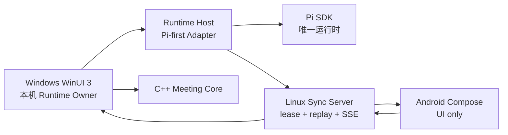

# Pi Roundtable

Pi Roundtable 是一个原生 GUI 优先的多角色圆桌会议平台。当前交付面是 Pi-only、Windows local-first alpha：多个角色可以实时发言、互相打断、经人类审批调用工具并派出隔离 SubAgent，同时运行时、同步服务和各平台界面保持解耦。

## 当前状态

| 模块 | 状态 | 说明 |
| --- | --- | --- |
| `protocol` | 已实现契约基础 | 版本化 JSON Schema、TypeScript 类型、非可信命令/事件运行时校验与目录引用完整性校验；包含工作区、会话、冻结参与者清单、长短期角色生命周期，以及讨论模式/议程/发言申请/预算/收敛事件 |
| `core` | 已实现本地闭环基础 | C++20 状态机验证 Runtime Owner、租约代次、角色生命周期、发言、中断交接、自动主持控制事件与完整会议闭环；提供稳定 C ABI |
| `packages/runtime-host` | 已实现本地多角色 Host | 固定 Pi SDK；每角色一会话；稳定角色前缀、按实际模型窗口计算的自动压缩与 provider cache/session affinity；按冻结清单解析模型、System Prompt、经核验 Skill 与精确 MCP tool allowlist，明确拒绝在会议进程内加载 raw Pi extension；公开 `@` 目标语义编排且每个目标只以自身身份作答；确定性议程/自由讨论/收敛、优先级与公平性队列、有界角色观察/抢答、短轮次和防无限讨论预算；MCP 工具发现/调用及私有审批；不可递归、每父角色最多 2 个的隔离 SubAgent；stdio JSONL v3；持久命令回执、全局序号/代次与规范化事件 |
| `packages/sync-server` | 已实现受控远端基础 | 所有 `/v1` 路由使用签名设备令牌；运行时租约、代次围栏、游标回放、私有 audience 过滤、HTTP/SSE；可选 PostgreSQL 事务存储，无数据库时明确退回仅限开发的内存实现 |
| `apps/android` | 脚手架已验证 | Kotlin + Jetpack Compose Material 3，自适应手机/平板界面；Debug APK 与单元测试已在本机通过，尚未接入同步服务 |
| `apps/windows` | 已实现本地 alpha 闭环；新增基础层待接 UI | .NET 10 + WinUI 3；自适应会话轨道、严格单/多角色 `@`、公开/私聊、自动主持模式/议题/预算/队列状态带、审批到期与 SubAgent 活动；安全原生 Markdown、LaTeX 源码回退、长记录虚拟化/跟随/跳到最新；系统/亮色/暗色与高对比主题策略；会话 JSON/Markdown 导出与非破坏性导入预检；逐角色模型/System Prompt/Skill/MCP；Credential Manager；版本化 SQLite + 当前用户 DPAPI 的事件重放、调度快照、代次恢复及 append-only 角色记忆修订存储；Markdown/TeX/DrawIO/DOCX/PPTX/XLSX 安全输入规范化与 PDF 元数据预检基础（尚未接 composer）；自包含 x64 MSI；ECDSA 签名更新清单、固定公钥、大小/SHA-256 校验及独立更新辅助程序 |

“已实现/已验证”描述当前工作站和仓库测试面，不表示已经生产部署。仓库不保存提供商凭据；真实提供商验收结果只保留在被忽略的本机 `out/`。托管桌面会话无法截图时，功能状态与视觉状态会分开记录，UIA 结构快照不能冒充像素级视觉验收。Windows 代码签名流水线已实现且以临时证书验证机制，但正式可信证书、时间戳发布验收及 100%/200% 真实 DPI 证据仍依赖发布环境。角色记忆的自动提取/召回注入与管理 UI、文档附件 UI、真正的公式排版引擎、PDF 正文提取/OCR、DrawIO/Office/PDF 编辑型输出、ARM64、客户端远端同步接入、E2EE、TLS/限流/保留任务、多副本通知、推送和生产级重连仍是后续工作。

## 架构边界



核心约束：

- 每场会议同一时刻只有一个权威 Runtime Owner；服务器用 `runtimeGeneration` 防止旧实例继续写入。
- 无远程服务器时，Windows 仍应能完成正常本地会议；Linux 服务是可选同步平面，不执行模型。
- 客户端只依赖版本化协议；Pi 内部事件和原始会话必须留在 Runtime Host 内部。
- 移动端使用前台流式连接、游标回放与后续推送，不假设永久后台 WebSocket。
- 角色打断是显式状态转换：请求打断 → 取消当前发言 → 新角色取得发言权。
- 角色观察最多三路并发，公开话筒始终串行；模型返回速度不决定发言顺序，抢答必须经过 exact-evidence 和次数预算。

更完整的边界见 [架构说明](docs/architecture.md)、[运行时所有权 ADR](docs/adr/0001-runtime-ownership.md)、[Pi-first 运行时 ADR](docs/adr/0003-pi-first-runtime.md)、[现代 Agent/Windows 基线 ADR](docs/adr/0004-modern-agent-and-windows-baseline.md)、[本地纵向闭环 ADR](docs/adr/0005-local-roundtable-vertical-slice.md)、[会话与能力清单 ADR](docs/adr/0006-session-workspaces-and-capability-manifests.md) 和 [上下文、记忆、插件与文档边界 ADR](docs/adr/0010-runtime-context-memory-plugins-and-artifacts.md)。客户端信息架构见 [会话中心设计](docs/product/session-centered-client.md)，`v0.4` 到 `v0.8` 的逐项实现与发版证据见 [implementation backlog](docs/product/v0.4-v0.8-implementation-todo.md)。

## 快速开始

### C++ 核心

```powershell
cmake --preset dev
cmake --build --preset dev
ctest --preset dev
```

### TypeScript 服务

```powershell
npm install
npm run build
npm test
npm run dev:sync
```

仓库根目录的 `VERSION` 是当前构建版本；npm workspace/lock 与 Runtime Host
身份通过 `npm run check:version` 核对，并可用
`npm run version:set -- <major.minor.patch>` 幂等更新。该命令不会改写已签名的稳定
更新清单或历史 QA 版本。更新命令在首次写入前校验全部目标，使用互斥锁和可恢复事务
日志，进程中断后下次调用会先回滚。跨平台快速质量门禁可运行
`npm run quality:fast`；Windows 打包、默认 ICE、签名机械链与隔离 MSI 生命周期使用
`npm run quality:windows`。每次门禁写入独立运行目录；命令退出码只记录为 `passed`，
只有解析并核对版本、提交、工件哈希和时间的报告才能记录为 `verified`。

正式 `ReleaseCandidate` 是对已经完成的签名构建及现场证据作最终失败关闭核验：必须
提供完整测试/ICE 均未跳过的生产签名构建报告、与已签名 stable manifest 字节一致的
基线 MSI、同一候选工件在 clean VM 上完成真实 production stable→candidate 升级的
报告，以及绑定同一 WinUI EXE 的真实 96/144/192 DPI 报告。普通 CI、一次性自签名
smoke 和隔离 QA UpgradeCode 生命周期都不能替代这些证据。完整契约见
[`Release Candidate evidence contract`](docs/quality/release-candidate-evidence.md)。

同步服务默认监听 `http://127.0.0.1:4317`。健康检查无需认证；所有 `/v1` 路由都要求由 `PI_ROUNDTABLE_AUTH_KEYS_JSON` 验证的签名设备令牌。未设置 `DATABASE_URL` 时仅使用内存存储，适合有界本机开发；配置 PostgreSQL 后启动时会应用幂等迁移。令牌约束和待完成的 TLS/E2EE 边界见 [`packages/sync-server/README.md`](packages/sync-server/README.md)。

### Android

```powershell
.\scripts\android-build.ps1
```

要求 JDK 17 与 Android SDK 37。脚本会把当前 `HTTPS_PROXY`/`HTTP_PROXY` 显式转换为 Gradle JVM 代理参数，但不会记录代理凭据。若 SDK 不在默认位置，请设置 `ANDROID_HOME`，或在未纳入版本控制的 `local.properties` 中设置 `sdk.dir=...`。

### Windows

安装仓库 `global.json` 所指定的 .NET 10 SDK 与 Visual Studio 的 WinUI 应用开发工作负载后，先构建 Runtime Host 与本机 Core：

```powershell
node --version
npm run build
cmake --preset dev
cmake --build --preset dev
dotnet restore apps/windows/PiRoundtable.Windows/PiRoundtable.Windows.csproj
dotnet build apps/windows/PiRoundtable.Windows/PiRoundtable.Windows.csproj
```

开发客户端会向上查找 `packages/runtime-host/dist/host-main.js`，并在 x64 构建时复制 `out/build/dev/core/pi_roundtable_core.dll`。源码 checkout/测试也可分别用 `PI_ROUNDTABLE_RUNTIME_HOST_SCRIPT` 与 `PI_ROUNDTABLE_NODE_PATH` 指定路径；自包含发布版始终优先使用应用目录内的 Node 与 Runtime Host，不接受环境变量覆盖。非敏感工作区配置保存到 `%LOCALAPPDATA%\PiRoundtable\workspace.v1.json`，会话定义保存到 `%LOCALAPPDATA%\PiRoundtable\sessions\`；规范化事件与角色记忆修订写入版本化的 `%LOCALAPPDATA%\PiRoundtable\data\roundtable.db`，正文由当前 Windows 用户 DPAPI 加密。API Key 按 `credentialRef` 保存到 Windows Credential Manager，启动时只把本场角色所需凭据通过一次性 stdin 初始化帧交给本地子进程，不进入环境、事件或 JSON 配置。

生成未签名但可由签名清单安全分发的自包含 x64 MSI：

```powershell
pwsh -File .\scripts\build-windows-x64.ps1 -Version 0.3.0
```

脚本先运行 C++、TypeScript 和 Windows 测试，再发布 WinUI、自带 Node/Pi Runtime Host 和 C++ Core，最后输出 `out\installer\PiRoundtable-0.3.0-win-x64.msi` 及 SHA-256。WiX ICE03 警告按明确 allowlist 严格核对，出现未知、缺失或额外 warning 都失败；`-SuppressMsiValidation` 只能在等价发布包已经通过验证后用于受限环境重打包，不能算验证路径。客户端更新器只接受固定 ECDSA P-256 公钥验证通过的规范清单，并逐字节验证 MSI 大小和 SHA-256。未提供正式代码签名证书时 MSI 仍为未签名本地 alpha，清单必须保持 `authenticodeRequired: false`。

Windows 发布门禁现提供三组自动化：

```powershell
# 以一次性、非导出自签名证书验证“先签二进制、再构建、最后签 MSI”的机械链路；不构成生产信任
pwsh -File .\scripts\test-windows-signing-pipeline.ps1

# 使用隔离 UpgradeCode/ProductName 跑安装、启动、修复、升级、降级阻止、再修复和卸载；默认用真实 WinUI 壳的精简负载
pwsh -File .\scripts\test-windows-msi-lifecycle.ps1
# 发布机可显式使用完整生产负载
pwsh -File .\scripts\test-windows-msi-lifecycle.ps1 -UseFullPayload

# 在当前真实 DPI 会话核验亮色、暗色和系统高对比，并在 finally 中恢复系统设置
pwsh -File .\scripts\run-windows-theme-visual-qa.ps1 `
  -AppRoot .\out\package\windows-x64\app -ExpectedDpi 144
```

`merge-windows-visual-matrix.ps1` 只接受真实 96/144/192 DPI 会话分别生成、且产品版本、Git 提交与应用 EXE SHA-256 完全一致的三主题报告；任何缺失、过期或实际 DPI 不符都会失败。正式签名使用 `build-signed-windows-x64.ps1`，证书必须来自仓库外的 PFX 或证书存储，PFX 密码只能存在于当前进程环境，并要求 RFC 3161 时间戳与可信链验证。脚本会输出 `signed-build-report.json`，但使用 `-SkipVerification` 或 `-SuppressMsiValidation` 的构建只能标记为 `passed`，不能进入 RC。完整操作和证据口径见 [`packaging/windows-x64/README.md`](packaging/windows-x64/README.md)。ARM64 MSI 仍为 pending。

当前 Windows 工作站已分别 verified 精简 WinUI 壳和完整 22,594 文件生产负载的隔离生命周期；这证明自动化及当前 0.2.1→0.2.2 QA 包可完成安装、修复、升级、降级阻止和卸载，但每个新的 release candidate 仍必须重新运行，不能沿用本次现场结果。

已有测试凭据时，可对发布目录执行一次不回显 Key 的真实 DeepSeek/Pi 三角色、三轮全链路验收：

```powershell
pwsh -File .\scripts\run-windows-deepseek-roundtable.ps1 `
  -KeyFile C:\path\to\Deepseek.txt `
  -AppDirectory .\out\package\windows-x64\app
```

脚本优先通过临时 Windows Credential Manager 记录向客户端提供凭据，受限桌面会话则使用仅限当前用户、单次读取且有尺寸上限的随机命名管道：第一轮在议程模式验证单点名与表格、任务项、LaTeX 源码块、PowerShell 代码块；第二轮保持议程模式验证双点名只由产品体验官与风险审查员回答；第三轮进入自由讨论，验证暂停/继续自动主持，以及未点名角色通过有界观察自主申请发言或抢答。证据只在被忽略的 `out\e2e\` 保存角色、状态、字符数、输出 SHA-256 和事件归属；截图优先使用窗口原生 `PrintWindow`，再回退到屏幕捕获，二者都不可用时才把视觉状态标为 pending 并保存非等价的 UIA 结构快照。脚本扫描包含完整 data-root 的证据树是否残留 Key，并在退出后删除临时凭据。实现现状、参考项目迁移边界和后续 P0/P1 见 [Agent 客户端实践与差距审计](docs/research/2026-08-02-agent-client-practices-and-gap-analysis.md)。

## 版本基线

- Pi：默认运行时，`@earendil-works/pi-coding-agent` 与 `@earendil-works/pi-ai` 固定为 `0.83.0`。
- Android：AGP `9.1.1`、Gradle `9.3.1`、JDK 17、Compose BOM `2026.06.00`。
- Windows：Windows App SDK `2.3.1`、`.NET 10` LTS。
- Node.js：开发基线 Node 24。

版本选择与集成风险记录在 [依赖基线](docs/dependency-baseline.md)。
