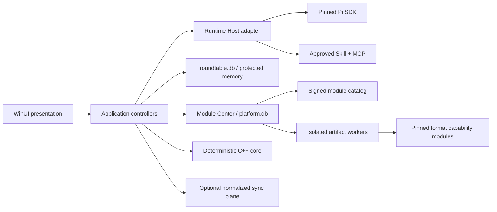

# Pi Roundtable v0.4-v0.8 implementation backlog

- Baseline: `v0.3.0`
- Updated: 2026-08-04
- Delivery model: Windows local-first, Pi-only runtime, Android UI-only
- Scope: architecture foundations, provider context efficiency, durable memory,
  module/artifact platform, document formats, Windows bootstrapper, and the
  first-party Skill/MCP ecosystem

This file is the executable product backlog for the path to `v0.8`. It does
not replace the architecture or ADRs. A checked implementation item means the
code and automated tests exist on the release branch. A release verification
item is checked only after its named candidate has produced fresh evidence.

## 1. Status and delivery rules

Every item uses one of these states in issues, pull requests, diagnostics, and
release notes:

- `planned`: accepted scope with no production implementation yet.
- `scaffolded`: contract or replaceable seam exists, but the user path is not
  complete.
- `implemented`: the user or runtime path exists and its smallest relevant
  automated tests pass.
- `pending`: work or environment-specific verification is still required.
- `verified`: the named candidate passed the specified automated and real
  scenario gates; verification is time-bound and is not inherited by a later
  candidate.

`connected` may appear as a separate user-path column in the older foundation
roadmap. It is not an implementation/verification state: a backend can be
`implemented` while its UI remains disconnected, and a connected path is not
`verified` until its candidate passes the named gate.

Release work follows these rules:

- [ ] `GOV-001` Keep `protocol/schema` as the only public cross-platform
  contract. Raw Pi sessions, provider cache records, DPAPI ciphertext,
  platform module journals, and SDK-private types never enter it.
- [ ] `GOV-002` Keep `core` deterministic C++20 and free of network, UI,
  runtime-process, document, plugin, and database concerns.
- [ ] `GOV-003` Keep all Pi SDK integration in `packages/runtime-host`.
- [ ] `GOV-004` Require the active `runtimeGeneration` on every meeting write;
  preserve one authoritative Runtime Owner per meeting.
- [ ] `GOV-005` Keep the sync server a normalized relay and persistence plane,
  not the default model executor.
- [ ] `GOV-006` Preserve old database/session/config inputs through additive
  migration or explicit read-only recovery. Never silently discard them.
- [ ] `GOV-007` Land each bounded slice through tests, a reviewable commit, a
  pull request, required CI, and protected-main merge. Tag only after the full
  milestone gate passes.
- [ ] `GOV-008` Pin every shipped dependency or signed module asset. Record its
  license, source, digest, supported architectures, and removal/rollback path.
- [ ] `GOV-009` Treat network, documents, plugin output, memory candidates, and
  provider usage as untrusted input with explicit size/time/count budgets.
- [ ] `GOV-010` Preserve unrelated user work and never commit generated build
  output, credentials, raw Pi sessions, local databases, or QA evidence.

## 2. Required evidence for every feature

Unless a task explicitly says otherwise, a feature is not `verified` until it
has evidence for all applicable paths:

- [ ] `EVD-001` success and deterministic repeated execution;
- [ ] `EVD-002` cancellation before and during the first irreversible action;
- [ ] `EVD-003` timeout and bounded resource exhaustion;
- [ ] `EVD-004` malformed, truncated, oversized, duplicated-field, traversal,
  and signature/hash mismatch inputs;
- [ ] `EVD-005` permission denial and missing optional dependency;
- [ ] `EVD-006` process restart, interrupted journal recovery, and atomic
  promotion/rollback;
- [ ] `EVD-007` previous supported version migration or compatibility fallback;
- [ ] `EVD-008` redaction: no credential, private memory, raw provider content,
  absolute private path, or private-audience data in public logs/exports;
- [ ] `EVD-009` accessibility, narrow/wide layout, high contrast, keyboard, and
  screen-reader naming for a new Windows UI path;
- [ ] `EVD-010` measured latency, memory, disk size/file count, and steady-state
  regression against the recorded baseline when the feature affects them.

## 3. v0.4 - architecture and security foundations

Goal: make later provider, memory, module, artifact, and installer work land on
small replaceable seams while preserving all v0.3 behavior.

### 3.1 Repository and release contract

- [x] `V04-REL-001` Add one canonical repository version record plus an
  idempotent version-update command covering npm workspaces, CMake, Windows,
  WiX, packaging defaults, CI artifact names, lifecycle defaults, and release
  manifest inputs.
- [x] `V04-REL-001A` Before an RC is built, advance every current-build binding
  to the candidate version while the signed stable update manifest remains
  independently bound to its actually published asset. README examples and
  historical QA records must be labelled instead of participating as version
  sources.
- [x] `V04-REL-002` Add a version-consistency gate that fails on stale or mixed
  release literals, but allow explicitly labelled historical evidence.
- [x] `V04-REL-003` Add one local quality entry point with `fast`, `windows`,
  and `release-candidate` scopes. Preserve required CI job names `cpp-core` and
  `typescript`.
- [x] `V04-REL-004` Parse every PowerShell script in the fast Windows gate;
  introduce pinned PSScriptAnalyzer only after a clean baseline and a measured
  runtime budget are recorded.
- [x] `V04-REL-005` Add schema catalog checks for valid JSON, unique `$id`,
  local `$ref` resolution, declared draft, and additive v1 evolution fixtures.
- [x] `V04-REL-006` Remove stale current-release wording from README and
  packaging docs without rewriting historical QA evidence as current proof.
- [ ] `V04-REL-007` Automate production-UpgradeCode clean-VM evidence capture
  with an explicit disposable-VM attestation. Keep final RC validation capable
  of accepting a separately produced, content-addressed report until that
  harness is implemented and verified on the release VM image.

### 3.2 Generic distribution and trust substrate

- [x] `V04-DST-001` Extract a Windows-neutral, dependency-free artifact
  integrity library for immutable expected size and SHA-256, bounded stream
  copy, existing-file re-verification, fixed-time digest comparison, reparse
  rejection, and verified read locks.
- [x] `V04-DST-002` Reuse the substrate in both `WindowsUpdateService` and the
  independent updater helper without weakening ECDSA manifest validation,
  redirect policy, Authenticode, parent-process fencing, or atomic staging.
- [x] `V04-DST-003` Define a versioned signed-catalog envelope verifier with
  strict duplicate/unknown-field rejection, key ID/algorithm binding, expiry,
  monotonic epoch/sequence anti-rollback, same-origin asset policy, and key
  rotation/revocation fixtures. Do not connect module installation in v0.4.
- [x] `V04-DST-004` Define a credential-free verification result and diagnostic
  taxonomy reusable by updater, module catalog, artifact import, and offline
  layout verification.
- [ ] `V04-DST-005` Fuzz or property-test JSON envelope, digest parsing, URI,
  file-name, path containment, reparse, and interrupted-promotion boundaries.
  Deterministic adversarial cases, a seeded malformed-byte corpus, and complete
  single-character SHA-256 mutation coverage are implemented. Deterministic
  staging reparse, cross-process serialization, orphan cleanup, and sidecar
  failure recovery are implemented; sustained fuzz and forced process
  termination throughout the commit region remain pending.
- [x] `V04-DST-006` Make staging handle-relative and reparse-safe: lock parent
  directories during path resolution, create a new leaf without following
  reparse points, verify Authenticode against the same locked file, and promote
  that handle atomically. A path-only check followed by reopen/move is not an
  acceptable release boundary. The implemented boundary and recovery semantics
  are recorded in ADR 0012.

### 3.3 Windows application seams

- [x] `V04-WIN-001` Move concrete store/service construction behind an
  application composition root; keep views free of store/runtime construction.
- [ ] `V04-WIN-002` Extract `MeetingCommandGateway` first: public prompt,
  private prompt, discussion controls, approval decisions, receipt mapping,
  cancellation, and active-generation propagation.
- [ ] `V04-WIN-003` Extract `MeetingSessionController`: start, pause, resume,
  close, generation increment, replay, checkpoint validation, and recovery.
- [ ] `V04-WIN-004` Extract `MeetingProjectionController`: accepted event ->
  C++ reducer -> durable append -> UI projection, preserving sequence order.
- [ ] `V04-WIN-005` Extract workspace, role-profile, and catalog controllers one
  use case at a time with locked behavior tests before moving code.
- [ ] `V04-WIN-006` Add explicit diagnostics for stale-generation drops,
  duplicate sequence, sequence gap, persistence failure, and projection failure
  without persisting private payloads.
- [ ] `V04-WIN-007` Keep `MainViewModel` as a presentation adapter; set and
  enforce a decreasing file-size/complexity budget rather than a big-bang
  rewrite.

### 3.4 Runtime Host seams

- [x] `V04-RUN-001` Extract `RuntimeGenerationOwner` and lease lifecycle from
  the monolithic local host; validate initialize/start/stop/late-command races.
- [x] `V04-RUN-002` Extract `MeetingCommandRouter` with deterministic command
  serialization, idempotent receipt behavior, and fail-closed generation and
  sequence checks.
- [x] `V04-RUN-003` Extract `RoleSessionSupervisor` and keep every Pi session,
  credential lease, abort controller, MCP client, and SubAgent scoped to one
  role and one runtime generation; fence queued floor, handoff, observer, and
  SubAgent work by the exact role-session token rather than the public role ID.
- [x] `V04-RUN-004` Introduce `RoleContextAssembler`,
  `ProviderCapabilityRegistry`, and `CapabilityResolver` interfaces while
  preserving current Pi behavior.
- [x] `V04-RUN-005` Introduce `DiscussionOrchestrator` and
  `NormalizedEventWriter` seams without changing scheduler order, observation
  budgets, private audience, or public event payloads.
- [x] `V04-RUN-006` Replace ambient credential lifetime with an explicit
  zeroizable credential lease; prove secrets are cleared on stop, failed start,
  cancellation, and child-process exit.
  - Meeting and role owners overwrite their independently allocated UTF-8
    buffers; tests cover failed start, root cancellation, meeting/Host stop,
    terminal stdio cleanup, EOF, and a real `host-main` process exit.
  - Pi/MCP/managed-client APIs still require immutable strings. Their copies
    are disposed and dereferenced or reclaimed with process exit; they are not
    described as physically zeroized.

### 3.5 Storage and diagnostics groundwork

- [x] `V04-DAT-001` Add direct schema tests for fresh initialization, v1 -> v2
  migration, unsupported future version, corrupt metadata, transaction rollback,
  concurrent initialization, and preservation of existing event/memory rows.
- [x] `V04-DAT-002` Specify, but do not create empty production tables for,
  `roundtable.db` v3 memory candidates, recall audits, context snapshots, and
  memory retention jobs.
- [x] `V04-DAT-003` Specify separate `platform.db` ownership, schema version,
  backup boundary, and migration journal for modules, artifacts, and local
  diagnostics; do not mix these records into meeting event storage.
- [ ] `V04-OBS-001` Define private, versioned diagnostic records for provider
  usage, context compaction, memory recall, module operations, and artifact
  workers with field-level redaction rules.
- [ ] `V04-OBS-002` Add bounded local retention, export preview, and explicit
  content opt-in before any OpenTelemetry exporter can be enabled.

### 3.6 v0.4 release gate

- [ ] `V04-GATE-001` C++ configure/build/test, TypeScript clean build/tests,
  Windows Release tests, schema checks, and PowerShell parse gate pass.
- [ ] `V04-GATE-002` Existing runtime generation, recovery, memory, document,
  updater, signing-pipeline, MSI-contract, and session-transfer tests show no
  regression.
- [ ] `V04-GATE-003` Self-contained publish and Runtime Host/protocol import
  smoke pass from a clean staging directory.
- [ ] `V04-GATE-004` Default ICE, administrative extraction, isolated full MSI
  install/launch/repair/upgrade/downgrade block/second repair/uninstall pass for
  the v0.4 candidate.
- [ ] `V04-GATE-005` Signed manifest, exact re-download, updater re-verification,
  and rollback/tamper scenarios pass.
- [ ] `V04-GATE-006` Create and publish `v0.4.0` only from protected `main` and
  attach fresh evidence; update checks must not offer equal/older versions.

## 4. v0.5 - provider context efficiency and durable role memory

Goal: make compression/cache behavior observable and provider-compatible, then
connect user-controlled long-term memory without exposing it as public meeting
state.

### 4.1 Provider capability and cache policy

- [ ] `V05-CTX-001` Implement private `ProviderCapabilityProfileV1` for OpenAI,
  Anthropic/Claude, DeepSeek, compatible endpoints, and conservative unknown
  providers. Resolve by provider family plus actual model metadata, not display
  name substring alone.
- [ ] `V05-CTX-002` Separate stable role prefix, session-frozen memory context,
  dynamic agenda/routing, recent turns, large tool results, and provider-private
  state in `RoleContextSnapshotV1`.
- [ ] `V05-CTX-003` Preserve byte-for-byte stable reusable prefixes; record a
  prefix fingerprint and explain every invalidation without logging content.
- [ ] `V05-CTX-004` Map OpenAI automatic prefix caching, Anthropic explicit
  cache breakpoints/TTL, DeepSeek automatic disk cache, and unsupported-provider
  no-op behavior behind the private adapter.
- [ ] `V05-CTX-005` Add bounded `ProviderUsageSampleV1` parsing for provider
  input/output/cache-read/cache-write tokens; missing fields remain unknown,
  never fabricated zeroes.
- [ ] `V05-CTX-006` Surface cache eligibility, hit rate, token savings estimate,
  invalidation cause, and provider support in a local diagnostics UI.
- [ ] `V05-CTX-007` Add synthetic compatible-provider fixtures: ignored cache
  hints, rejected cache fields, missing usage, alternate usage names, partial
  streaming usage, retry, and provider model-window disagreement.

### 4.2 Compaction pipeline

- [ ] `V05-CMP-001` Implement `ContextCompactionRecordV1` with trigger ratio,
  before/after token estimates, retained turn range, summary digest, duration,
  provider/model, and failure/fallback reason.
- [ ] `V05-CMP-002` Use actual resolved context windows when reliable; fall back
  conservatively when unknown. Reserve output and tool-call headroom.
- [ ] `V05-CMP-003` Keep recent turns verbatim, summarize older public context,
  exclude private lanes not visible to the role, and never summarize hidden
  provider reasoning as meeting facts.
- [ ] `V05-CMP-004` Persist resumable role context snapshots at turn boundaries;
  validate meeting, role, generation, prefix fingerprint, source sequence, and
  policy version before restore.
- [ ] `V05-CMP-005` On corruption/incompatibility, discard only the private
  snapshot and rebuild from normalized events; never corrupt meeting history.
- [ ] `V05-CMP-006` Add adversarial long-session tests for late constraints,
  negation, renamed roles, tool failures, private/public separation, repeated
  compaction, restart, and stale-generation writes.

### 4.3 Long-term role memory

- [ ] `V05-MEM-001` Migrate `roundtable.db` to v3 with encrypted
  `memory_candidates`, append-only `memory_recall_audits`, immutable
  `role_context_snapshots`, and bounded `memory_retention_jobs`; preserve v2
  tables and rollback atomically on failure.
- [ ] `V05-MEM-001A` Require `V04-DAT-001` and the reviewed v3 schema contract
  from `V04-DAT-002` before the first production migration is merged.
- [ ] `V05-MEM-002` Add memory candidate APIs for manual, review-required, and
  meeting-close policies with source evidence, confidence, safety scan, and
  optimistic decision revision.
- [ ] `V05-MEM-003` Add Windows memory UI for active entries, candidates,
  approve/reject/edit, history, supersede/restore, provenance, retention, and
  clear recovery diagnostics.
- [ ] `V05-MEM-004` Freeze one bounded recall set when a role session starts:
  maximum four entries plus character/token budget, deterministic ranking, and
  explicit untrusted-background delimiters.
- [ ] `V05-MEM-005` Record which memory IDs/revisions were considered/selected
  and why, without duplicating plaintext memory in diagnostics or events.
- [ ] `V05-MEM-006` Ensure active-session recall never changes silently; edits
  affect the next role-session freeze unless an explicit restart command is
  accepted under the active generation.
- [ ] `V05-MEM-007` Add local backup/restore and corruption quarantine for
  events and role memory, with manifest, hashes, schema/version checks, atomic
  replacement, and no credential export.
- [ ] `V05-MEM-008` Prove memory and snapshots never enter session export,
  public/private normalized events, sync upload, crash logs, or provider context
  belonging to another role.

### 4.4 v0.5 real-provider and release gate

- [ ] `V05-GATE-001` Run recorded long meetings on available OpenAI,
  Anthropic/Claude, and DeepSeek APIs; keep credentials and raw content outside
  the repository.
- [ ] `V05-GATE-002` Report first/subsequent input tokens, cache read/write,
  cache-eligible prefix, hit rate, compaction points/duration, recent-turn
  retention, key-constraint recall, latency, and cost using provider-reported
  fields where available.
- [ ] `V05-GATE-002A` For each supported provider/model/window combination, run
  at least three independent cold-start plus warm-prefix sequences and one
  30-or-more-turn compaction meeting. Report median and range; do not compare
  estimated cost where the provider does not return the necessary usage fields.
- [ ] `V05-GATE-003` Require safe no-op/fallback for compatible or unknown
  providers. Provider-specific cache failure cannot abort a meeting.
- [ ] `V05-GATE-004` Run database migration/rollback, memory isolation,
  restart/rebuild, no-plaintext, UI accessibility, and 30+ turn recovery tests.
- [ ] `V05-GATE-005` Repeat full v0.4 release gates and publish `v0.5.0` from
  protected `main` with evidence and an explicit provider support matrix.

## 5. v0.6 - module and artifact platform

Goal: introduce a signed, resumable module plane and isolated artifact workers;
connect safe baseline format input/output without requiring optional desktop
software.

### 5.1 Platform database and module catalog

- [ ] `V06-MOD-001` Create separate `platform.db` v1 for catalog state,
  immutable module versions, active pointers, install journal, dependency
  observations, artifact index, worker jobs, diagnostics retention, and backup
  metadata, including its independent schema info and migration journal.
- [ ] `V06-MOD-002` Implement signed `ModuleCatalogV1`: catalog version,
  channel, architecture, epoch, sequence, issued/expiry times, modules, and
  signature. Reject duplicates, unknown required fields, expired/revoked keys,
  rollback, cross-origin assets, and unsupported architecture.
- [ ] `V06-MOD-003` Each module version records ID, semantic version,
  capabilities, dependencies, license, source, URLs, byte size, SHA-256,
  Authenticode policy, entry point, health check, rollback compatibility, and
  uninstall ownership.
- [ ] `V06-MOD-004` Download to a private partial path, enforce byte/time limits,
  verify catalog signature + size + SHA-256 + optional Authenticode, unpack into
  an immutable version directory, run health checks, then atomically switch the
  active pointer.
- [ ] `V06-MOD-005` Resume or roll back every interrupted journal state. Never
  execute from the download directory or delete the last known-good version.
- [ ] `V06-MOD-006` Add Module Center UI for capability, size, license, source,
  trust, installed/available version, update, rollback, remove, diagnostics,
  and offline catalog import.
- [ ] `V06-MOD-007` Keep module install/update/removal explicit. Background work
  may refresh a signed catalog but cannot silently install or downgrade code.
- [ ] `V06-MOD-008` Classify the pinned Open XML, PDFium, and KaTeX engines as
  first-party app-managed capability packs with catalog IDs, ownership, size,
  version, rollback, health check, and base-fallback behavior. They cannot rely
  on an unobserved machine installation in v0.6.

### 5.2 Artifact contract and workers

- [ ] `V06-ART-001` Implement private `ArtifactDescriptorV1`: artifact ID,
  meeting/workspace scope, media/format, original/safe display name, size,
  SHA-256, source, created time, producer/module version, sensitivity, and
  retention. Events receive only a future normalized reference proposal.
- [ ] `V06-ART-002` Implement framed `ArtifactWorkerProtocolV1` over anonymous
  pipe or stdio: request ID, operation, versioned input descriptor, bounded
  options, progress, cancellation, structured diagnostics, and output
  descriptors. Reject extra frames after terminal completion.
- [ ] `V06-ART-003` Run workers out of the UI and Runtime Host process with job
  object, process-tree kill, CPU/memory/time/output limits, minimal environment,
  private temp ACLs, and no provider credentials.
- [ ] `V06-ART-004` Use content-addressed immutable storage plus a transactional
  index and reference counts. Write through temp + flush + atomic promote;
  reopen and verify every generated file before indexing it.
- [ ] `V06-ART-005` Add quota, preview/delete/restore, retention jobs,
  workspace backup manifest, orphan reconciliation, and corruption quarantine.
- [ ] `V06-ART-006` Connect composer attachment selection, preflight summary,
  warning/removal, cancellation, retry, and send-failure preservation. Do not
  put local absolute paths or file bytes into normalized events.

### 5.3 Base format modules

- [ ] `V06-FMT-001` Markdown: safe CommonMark/GFM input, deterministic UTF-8
  output, source/render/copy consistency, fenced-code limits, link/image policy,
  and accessible fallback.
- [ ] `V06-FMT-002` TeX/LaTeX: inert source input and deterministic source
  output in base install; preserve encoding, line endings policy, warnings, and
  explicit statement that compilation is an optional module.
- [ ] `V06-FMT-003` DrawIO: bounded XML metadata/text preview and source output,
  with DTD/external entities disabled and no embedded browser execution.
- [ ] `V06-FMT-004` DOCX/XLSX/PPTX: use a pinned Open XML SDK structural module
  for macro-free read/write, package relationship validation, shared strings,
  formulas-as-formulas, styles/themes/media preservation where an operation
  does not intentionally edit them, and reopen verification.
- [ ] `V06-FMT-005` PDF: integrate a pinned PDFium extraction/render module for
  page-count, bounded text, thumbnail/preview, encrypted/corrupt status, and
  render smoke. No editing claim in v0.6.
- [ ] `V06-FMT-006` KaTeX: render local pinned assets inside a locked-down
  WebView2 document with network/navigation/download/script bridge disabled;
  retain selectable source and failure fallback.
- [ ] `V06-FMT-007` Add golden corpus and malicious corpus for every format:
  empty, Unicode, large, deeply nested, external reference, traversal, macro,
  compression bomb, damaged relation, password/encryption, cancellation, and
  round-trip structural comparison.

### 5.4 Packaging slimming phase I

- [ ] `V06-PKG-001` Record reproducible v0.3 baseline: MSI 148,653,395 bytes,
  staged app about 411.05 MiB/10,855 files, embedded Node about 88 MiB,
  Runtime Host production dependencies about 58 MiB/10,307 files, and updater
  about 41.87 MiB. Re-measure from the candidate before comparison.
- [ ] `V06-PKG-002` Replace the self-contained .NET updater with a small native
  Windows helper while preserving parent identity, verified file lock, size/
  SHA-256 recheck, UAC handoff, exit-code policy, relaunch, and logs.
- [ ] `V06-PKG-003` Audit Runtime Host production closure by actual module import
  graph and license; remove duplicate/development/package-manager metadata only
  with import and real-meeting smoke evidence.
- [ ] `V06-PKG-004` Keep optional format engines and language packs outside the
  base MSI. The base app must still import/export its safe fallback formats.
- [ ] `V06-PKG-005` Target v0.6 base MSI <= 125 MiB, unpacked <= 380 MiB, file
  count <= 6,500, and updater <= 5 MiB, with no lifecycle regression. Targets
  are gates, not reasons to remove required runtime files blindly.
- [ ] `V06-PKG-006` Add one deterministic measurement script and JSON report
  recording Windows build, architecture, clean commit, build mode, compression,
  included capability packs, MSI bytes, staged bytes/files, per-component
  totals, and timings. Compare v0.3/v0.6/v0.7 only with the same script and VM
  image.

### 5.5 v0.6 release gate

- [ ] `V06-GATE-001` Catalog/install journal crash matrix, malicious catalog,
  key rotation/revocation, anti-rollback, offline import, rollback, removal, and
  last-known-good retention pass.
- [ ] `V06-GATE-001A` Fresh/create, forward migration, interrupted migration,
  backup, restore, corrupt database quarantine, concurrent open, and previous
  `platform.db` compatibility pass before module installation is verified.
- [ ] `V06-GATE-002` Artifact worker process containment, cancellation, quota,
  corruption, privacy, and format corpus pass.
- [ ] `V06-GATE-003` Base install works with no optional system dependency and
  degrades to source/structural fallbacks with actionable module suggestions.
- [ ] `V06-GATE-004` Meet measured packaging targets or publish a documented
  exception backed by import/lifecycle evidence; never relabel a larger result.
- [ ] `V06-GATE-005` Repeat all earlier release gates and publish `v0.6.0`.

## 6. v0.7 - dependency-aware bootstrapper and high-fidelity formats

Goal: ship a small base MSI plus signed optional capability packs. Detect and
reuse suitable machine dependencies; ask the user before standard installation
of anything missing; expose the same decisions in the in-app Module Center.

### 6.1 WiX v7 Burn bootstrapper

- [ ] `V07-SET-000` Complete a standalone WiX 4 -> WiX v7 compatibility spike:
  restore/build availability, MSI authoring conversion, extension compatibility,
  ICE output, component/Product/UpgradeCode stability, independent MSI install,
  and rollback to the v0.6 toolchain. Approve migration only after this report.
- [ ] `V07-SET-001` Migrate authoring/build tooling to pinned WiX v7 and add a
  signed Burn bundle with a native out-of-process bootstrapper application. The
  core MSI remains independently installable and repairable.
- [ ] `V07-SET-002` Model packages as base MSI, prerequisite packages, signed
  capability packs, language/OCR packs, and optional external-dependency setup.
- [ ] `V07-SET-003` Before planning, detect installed version, architecture,
  install scope, health, and ownership for WebView2, VC runtime, TeX runtime,
  LibreOffice, OCR, and any format engine that may use a machine installation.
- [ ] `V07-SET-004` Reuse only a compatible and healthy existing dependency.
  Never downgrade, repair, change defaults, or uninstall software the bundle
  does not own.
- [ ] `V07-SET-005` When a dependency is absent/incompatible, show capability,
  publisher, version, download size, disk impact, license, source, scope, restart
  expectation, and alternatives. Default to explicit user choice before a
  standard signed installer runs.
- [ ] `V07-SET-006` Support install-now, base-only, choose-later-in-Module-Center,
  offline-layout, retry, rollback, resume after reboot, repair, modify, and
  uninstall-owned-components-only flows.
- [ ] `V07-SET-007` Implement `/layout` with a signed catalog/manifest and every
  selected payload hash; a disconnected machine must verify the layout before
  executing it.
- [ ] `V07-SET-008` Share one capability/dependency observation model between
  Burn and Module Center without letting the app forge bundle ownership.
- [ ] `V07-SET-009` Use WiX OSMF only for an actual license-governed offering;
  present the MIT project license and third-party notices clearly and do not
  imply a commercial EULA where none applies.

### 6.2 High-fidelity optional modules

- [ ] `V07-FMT-001` Tectonic module: detect compatible system TeX first, offer
  a pinned app-managed runtime otherwise, compile offline by default, bound
  time/files/output, sanitize paths, capture diagnostics, and render-verify PDF.
- [ ] `V07-FMT-002` LibreOffice module: detect a compatible system installation
  without mutating it, or offer a pinned standard installer after consent; use
  a private profile and headless worker, disable macros/network, bound process
  tree, and reopen/render the result.
- [ ] `V07-FMT-003` Tesseract module and signed language packs: explicit language
  selection and disk cost, page/pixel/time caps, orientation confidence, source
  page mapping, and visible low-confidence warnings.
- [ ] `V07-FMT-004` DrawIO module: pinned local assets in a locked-down WebView2
  origin, no remote plugins/network/navigation, bounded IPC, source + rendered
  export, and XML round-trip preservation tests.
- [ ] `V07-FMT-005` Office high-fidelity paths preserve unaffected workbook
  formulas, shared/range formula semantics, styles, relationships, theme, notes,
  slide masters/layouts, media, section/page settings, and document properties;
  unsupported constructs generate explicit warnings rather than silent loss.
- [ ] `V07-FMT-006` PDF output uses a deterministic pinned generator, embeds or
  validates fonts, records page count/size, reopens and renders representative
  pages, and preserves source artifacts for reproducibility.
- [ ] `V07-FMT-007` Define per-operation fidelity levels: source-preserving,
  structure-preserving, render-equivalent, or lossy-with-warning. UI and artifact
  metadata must never overstate the achieved level.

### 6.3 Packaging and lifecycle targets

- [ ] `V07-PKG-001` Base MSI target <= 114 MiB (at least 20% below v0.3),
  unpacked <= 360 MiB, file count <= 4,300 (at least 60% below v0.3), updater
  < 5 MiB. Capability packs are measured and published separately.
- [ ] `V07-PKG-002` Measure cold install, repair, same-major upgrade, major
  upgrade, downgrade rejection, modify, optional-pack add/remove, rollback,
  uninstall, reboot resume, and offline layout on clean Windows VMs.
- [ ] `V07-PKG-003` No orphan services/tasks/registry/shortcuts/cache/temp or
  owned optional packs after uninstall; preserve user artifacts, settings, and
  externally owned dependencies unless the user explicitly chooses data removal.
- [ ] `V07-PKG-004` Sign bundle, BA, MSI, native helper, executable modules, and
  owned installers with the production identity and RFC 3161 timestamp. Verify
  again after download and before execution.

### 6.4 v0.7 release gate

- [ ] `V07-GATE-001` Clean/no-dependency, compatible-existing, incompatible-
  existing, offline, interrupted-download, reboot, non-admin, admin, damaged
  cache, and rollback VM matrices pass.
- [ ] `V07-GATE-002` Installation and Module Center show consistent dependency
  facts and choices; neither silently installs, downgrades, or removes software.
- [ ] `V07-GATE-003` High-fidelity golden corpus plus render comparison and
  malicious corpus pass within declared budgets.
- [ ] `V07-GATE-004` Repeat all earlier runtime/data/provider gates with base-
  only and full-capability installations, then publish `v0.7.0`.

## 7. v0.8 - first-party Skill/MCP ecosystem and controlled extension bridge

Goal: make auxiliary work discoverable, permissioned, reproducible, and easy to
author without giving third-party code ambient access to the meeting process.

### 7.1 First-party capabilities

- [ ] `V08-PLG-001` `planning`: turn a host objective into milestones,
  dependency graph, risks, verification plan, and progress updates; require
  human confirmation before external side effects.
- [ ] `V08-PLG-002` `memory-curator`: propose memory candidates with exact
  source evidence, type/confidence/write policy, contradiction grouping, and
  no automatic approval.
- [ ] `V08-PLG-003` `research`: bounded source collection, evidence tiers,
  citations, timestamp, contradiction tracking, and content-safe artifact output.
- [ ] `V08-PLG-004` `workspace-files`: scoped list/read/search/create/patch with
  canonical root containment, symlink/reparse denial, size/type policy, dry-run,
  and host approval for destructive changes.
- [ ] `V08-PLG-005` `artifacts`: invoke only installed format capabilities through
  `ArtifactWorkerProtocolV1`; return verified artifact descriptors, fidelity,
  warnings, and no raw binary event payloads.
- [ ] `V08-PLG-006` `quality-review`: run bounded repository checks and report
  actionable file/line evidence without claiming tests it did not execute.
- [ ] `V08-PLG-007` `release-auditor`: verify version consistency, clean tree,
  required CI/evidence, signatures, hashes, migration notes, SBOM/notices, and
  release-manifest binding; it cannot publish by itself.

### 7.2 Compatibility SDK and catalog

- [ ] `V08-SDK-001` Publish first-party Pi Skill templates and an MCP server SDK
  with versioned capability manifest, JSON Schema inputs/outputs, cancellation,
  progress, structured diagnostics, artifact references, approval metadata,
  test harness, and sample catalog entry.
- [ ] `V08-SDK-002` Support stdio and secure same-origin Streamable HTTP first;
  keep legacy SSE only for compatibility tests and document its limitations.
- [ ] `V08-SDK-003` Enforce exact tool allowlists, bounded discovery/output,
  per-role/per-meeting grants, explicit approval modes, execution quotas,
  cancellation, and private audience for approval state.
- [ ] `V08-SDK-004` Add signed install/update/revoke/rollback flow, capability
  conflict resolution, minimum host/API version, compatibility report, license,
  source, SBOM, and security contact.
- [ ] `V08-SDK-005` Add conformance suites for honest, malformed, oversized,
  slow, cancellation-ignoring, process-spawning, network-seeking, path-escaping,
  secret-seeking, and schema-changing servers.
- [ ] `V08-SDK-006` Add developer docs and samples for planning, file processing,
  Office artifact generation, memory proposal, and read-only diagnostics.

### 7.3 Raw Pi extension bridge - conditional gate

- [ ] `V08-EXT-001` Keep raw extensions `unsupported` until an out-of-process
  bridge passes every gate below. Never load them in the authoritative Runtime
  Host as a compatibility shortcut.
- [ ] `V08-EXT-002` Prototype a restricted-token process in an AppContainer or
  equivalently documented Windows sandbox, plus job object/process-tree kill,
  private working/temp ACL, minimal environment, and no provider credentials.
- [ ] `V08-EXT-003` Disable network by default; broker only declared normalized
  tools/files/artifacts, with size/time/count limits and MCP-equivalent approval.
- [ ] `V08-EXT-004` Treat extension output as untrusted schema-bound data. Raw Pi
  events, UI hooks, session mutations, and internal TypeScript objects cannot
  cross the bridge.
- [ ] `V08-EXT-005` Run malicious corpus and escape tests for child processes,
  named pipes, filesystem, registry, environment, credentials, localhost,
  external network, denial of service, cancellation, reboot, and stale bridge.
- [ ] `V08-EXT-006` If any containment, credential, network, cleanup, or protocol
  gate fails, ship v0.8 with raw extensions still unsupported and publish the
  failed capability explicitly. Skill/MCP compatibility remains unaffected.

### 7.4 v0.8 release gate

- [ ] `V08-GATE-001` First-party capabilities pass functional, authorization,
  cancellation, privacy, artifact, restart, and compatibility conformance.
- [ ] `V08-GATE-002` A clean external sample plugin can be authored from the SDK,
  packaged, signed, installed, granted to one role, executed, revoked, rolled
  back, and removed using only published interfaces.
- [ ] `V08-GATE-003` Run a real multi-role roundtable that uses planning,
  research, workspace files, bounded memory proposals, DOCX/XLSX/PPTX/PDF/TeX/
  DrawIO artifacts, human approvals, interruption, compaction, and restart.
- [ ] `V08-GATE-004` Verify base-only and full-capability install/upgrade/remove,
  provider compatibility, database migrations, module rollback, artifact backup,
  96/144/192 DPI, high contrast, keyboard, and long-session recovery.
- [ ] `V08-GATE-005` Publish `v0.8.0` from protected `main` only after required CI,
  production signing, hashes, SBOM/licenses, migration/rollback notes, support
  matrix, known limitations, and re-downloaded asset verification all pass.

## 8. Cross-milestone architecture map

Dependency direction is one-way: presentation -> application service ->
storage/runtime/module adapter. The C++ core and public protocol never depend on
provider, module, installer, or format-engine implementations.

## 9. Release ledger template

For each `v0.x.0` candidate, add a dated ledger entry or linked release report
containing:

- [ ] commit and protected-main CI run;
- [ ] exact dependency lock and module catalog sequence;
- [ ] database/config/protocol versions and rollback policy;
- [ ] test commands, counts, skips, failures, and reruns;
- [ ] real-provider support matrix and timestamp;
- [ ] MSI/bundle/module sizes, file counts, install/repair/upgrade/uninstall time;
- [ ] clean-VM and previous-release upgrade evidence;
- [ ] signatures, timestamp authority, SHA-256, SBOM, licenses, and notices;
- [ ] real scenario script, result, redactions, and known limitations;
- [ ] release asset re-download verification and updater offer/no-offer result.
